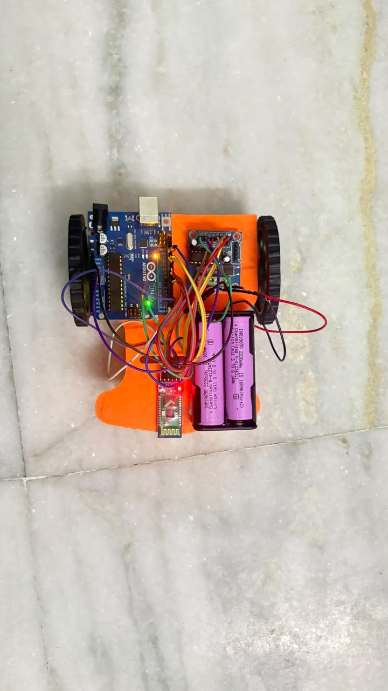
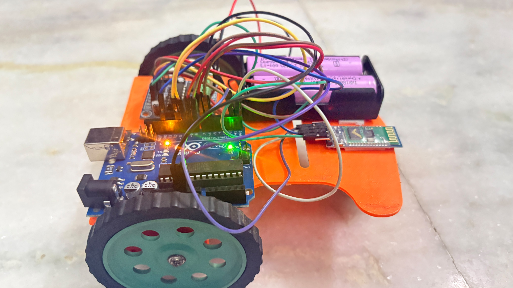
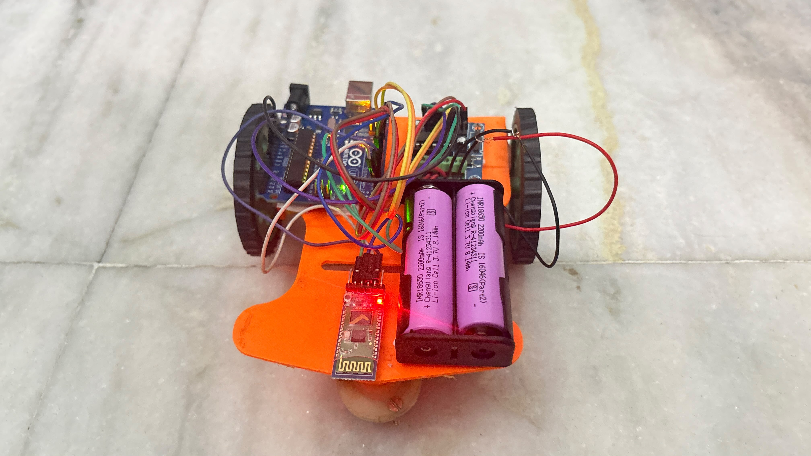
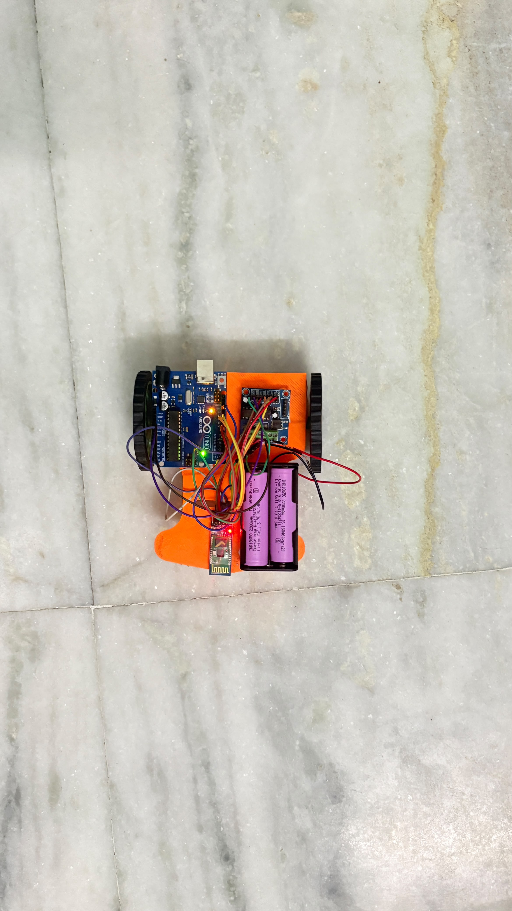
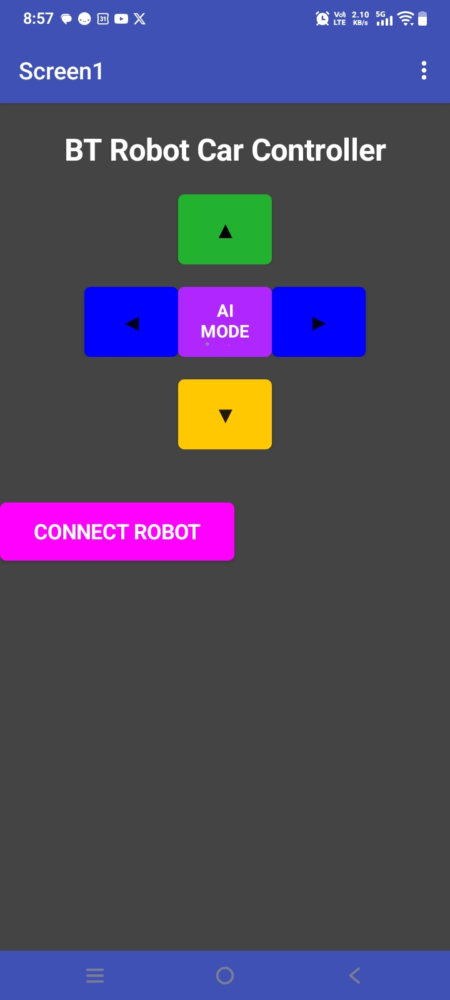

# 🚗 Bluetooth Controlled Robot Car

An Arduino-based Bluetooth controlled robot car that can be controlled wirelessly using a smartphone.

## 📌 Features

- Wireless Bluetooth control using HC-05
- Forward, Backward, Left and Right movement
- Stop command
- Arduino UNO based
- Real-time motor control
- Easy to customize

## 🛠 Components Used

- Arduino UNO
- HC-05 Bluetooth Module
- L298N Motor Driver
- TT DC Motors
- Robot Chassis
- 18650 Battery Pack
- Jumper Wires

## 📂 Repository Structure

```
code/
images/
videos/
docs/
```


## 📷 Project Gallery

### Robot Car



### Top View



### Side View



### Electronics



### Rear View



## 🎥 Demo Video

The working demonstration video is available in the **videos** folder.

## 🚀 Future Improvements

- Obstacle avoidance
- Line following
- NRF24L01 wireless controller
- Voice control
- Mobile app enhancements

  
## 🧠 Skills Demonstrated

- Embedded Systems
- Arduino Programming
- Bluetooth Communication
- Motor Driver Interfacing
- Circuit Design
- Hardware Debugging
- Mobile App Integration

## 👨‍💻 Author

**Naman Saini**

Electronics & Communication Engineering Student
